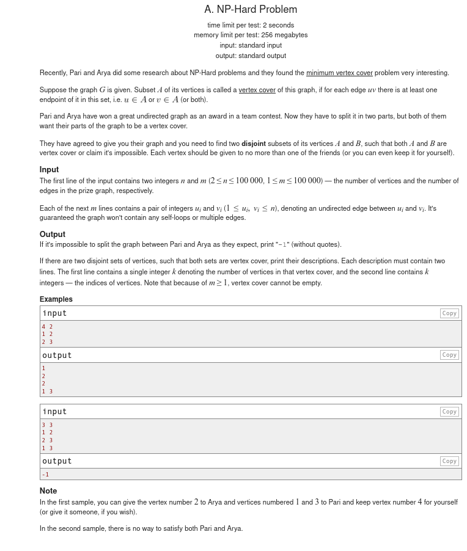
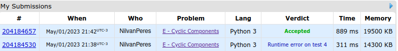

# Desafios Code Force

**Conteúdo da Disciplina**: Grafos 1 

## Alunos
|Matrícula | Aluno |
| -- | -- |
| 170122468  |  Nilvan Peres Costa |
| -  |  - |

## Sobre 
Esse projeto busca aplicar os conhecimentos adquiridos na matéria de Projeto de Algoritmos lecionada pelo professor Maurícion Serrano, através da resolução de problemas do site Code Force.

## Screenshots

### Exercício 1 - [Strongly Connected City](https://codeforces.com/group/ibNhxWfOek/contest/341358/problem/J)

- Descrição do problema:

- Logs de submissão:

### Exercício 2 - [NP Hard Problem](https://codeforces.com/problemset/problem/687/A)

- Descrição do problema:

- Logs de submissão:

### Exercício 3 - [Cyclic Components](https://codeforces.com/contest/977/problem/E)

- Descrição do problema:

- Logs de submissão:

### Exercício 4 - [Web of Lies](https://codeforces.com/contest/1549/problem/C)

- Descrição do problema:

- Logs de submissão:

## Instalação 
**Linguagem**: Python 3 
**Framework**: (caso exista) 
**Pré-requisitos**: Python 3.8 ou superior 

## Uso 

Para submeter as resoluções dos exercicíos basta seguir os passos abaixo:

1. Acesse a pasta do exercício desejado;

2. No arquivo 'explicacao.md' clique em link do problema;

3. O código fonte do problema que possui a extensão '.py';

4. No site do code force, seleciona a linguagem Python 3.8.10 e selecione o arquivo com o código fonte;

## Outros 
O vídeo pode ser acessado através do
[link](https://youtu.be/pNvazknntP4)

